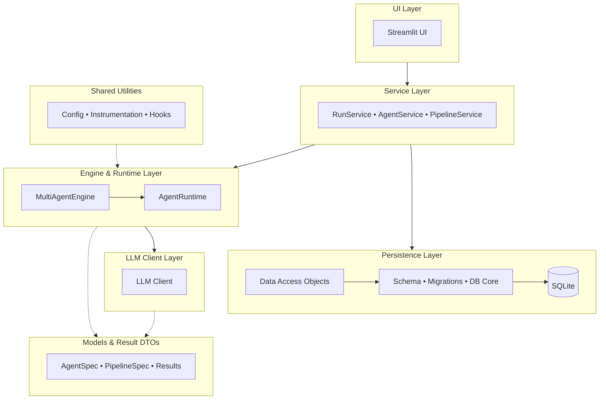
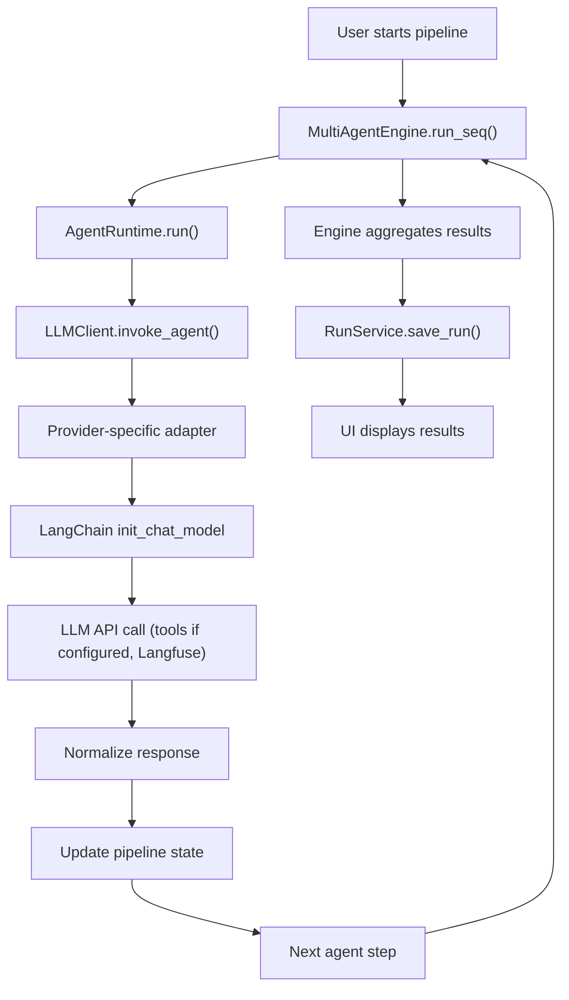
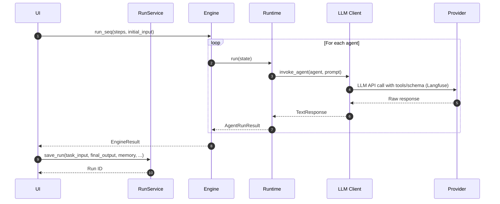
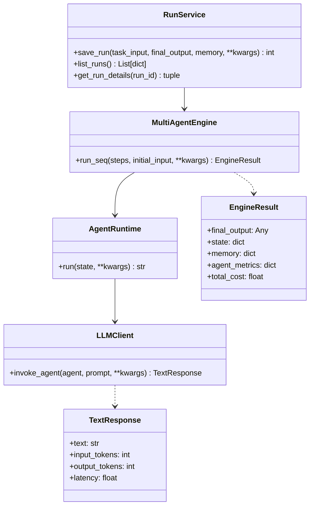
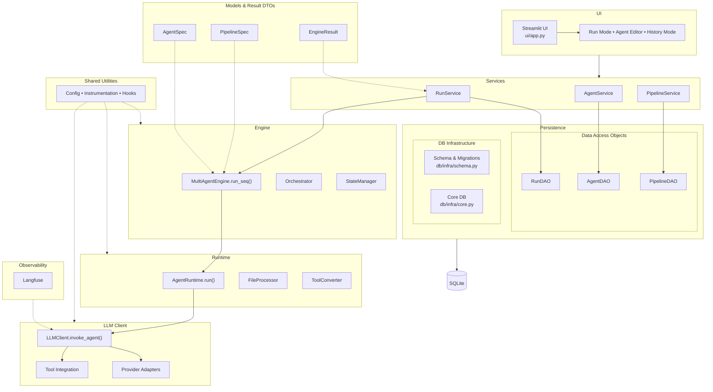
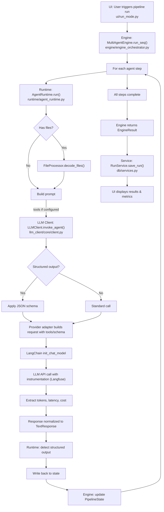
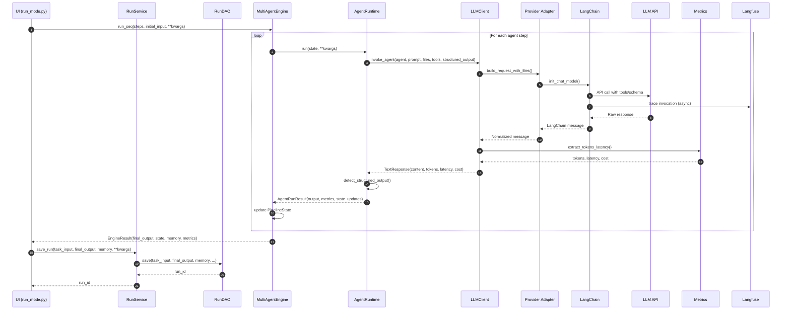
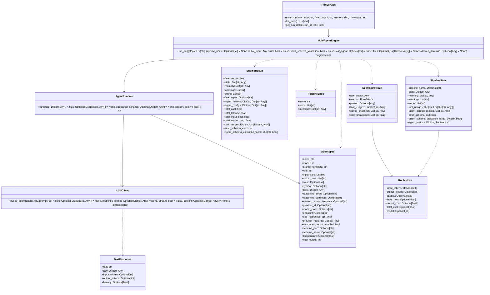
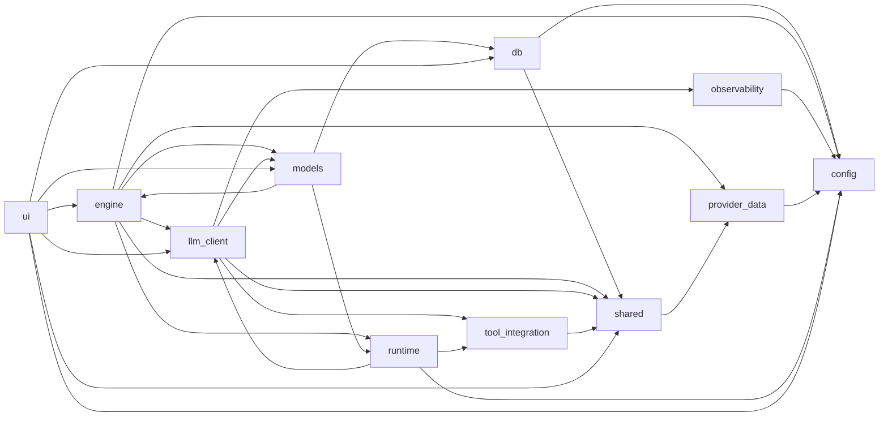

# 🏗️ Architecture (expanded)

This document expands the short architecture overview in the README with responsibilities and common extension points.

## High-level layers

The Multi-Agent Dashboard follows a layered, modular architecture that separates concerns and enables clear extension points. Each layer has distinct responsibilities and interacts with adjacent layers through well-defined interfaces.

### 🎛️ UI Layer (`ui/`)

**Purpose**: Provides the user interface for building, managing, and executing multi-agent pipelines via Streamlit.

**Responsibilities**:
- Presents interactive dashboards for agent editing, pipeline configuration, and run execution
- Visualizes run history, metrics, logs, and pipeline graphs
- Handles user inputs and file uploads, translating them into internal data structures

**Integration**: Communicates exclusively with the Service Layer (`db/services.py`) and Engine (`engine/`) for business logic—never directly accessing database internals. This ensures the UI remains agnostic to persistence details and can be replaced or extended independently.

**Design rationale**: Streamlit was chosen for rapid prototyping and rich interactive capabilities while maintaining Python‑native development. The UI is intentionally isolated from core engine logic to support future CLI or API frontends.

### 🧰 Service Layer (`db/services.py`)

**Purpose**: Provides high-level, transactional APIs that coordinate persistence and engine operations.

**Responsibilities**:
- Orchestrates complex operations involving multiple DAOs (agents, pipelines, runs)
- Manages transaction boundaries and error handling for UI and script clients
- Coordinates between persistence operations and engine executions

**Integration**: Sits between the UI and both the Persistence Layer (DAOs) and Engine Layer. Services call DAOs for CRUD operations and invoke the Engine for agent/pipeline execution, returning consolidated results.

**Design rationale**: Services encapsulate business logic that spans multiple entities, ensuring data consistency and providing a clean API for UI consumers.

### 🗃️ Persistence Layer (`db/*.py`)

**Purpose**: Manages persistent storage of agents, pipelines, runs, and related metadata in SQLite.

**Responsibilities**:
- Defines Data Access Objects (DAOs) for each entity type (`agents.py`, `pipelines.py`, `runs.py`)
- Handles low‑level SQL operations, parameter binding, and result mapping
- Provides backward‑compatible entry points via `db.py` (re‑exports DAOs and `init_db`)

**Integration**: Used by the Service Layer for all database operations. The DAOs are simple, focused classes that abstract table‑specific SQL away from business logic.

**Design rationale**: SQLite offers zero‑configuration, file‑based storage suitable for local development and lightweight deployments. DAOs keep SQL isolated and make schema evolution manageable through migrations.

### 🧱 DB Infrastructure (`db/infra/`)

**Purpose**: Provides database connectivity, schema management, migration tooling, and maintenance utilities.

**Responsibilities**:
- Bootstraps database connections and applies migrations (`core.py`, `migrations.py`)
- Defines the canonical schema (`schema.py`) and generates migration scripts (`generate_migration.py`)
- Supports safe schema evolution via rebuild helpers (`sqlite_rebuild.py`) for destructive changes
- Offers maintenance utilities: backups, snapshot pruning, constraint diffing, etc.

**Integration**: Used by the Persistence Layer during initialization and by maintenance scripts. The infrastructure is transparent to normal application code.

**Design rationale**: SQLite lacks built‑in migration facilities; this layer provides a robust, version‑controlled schema‑evolution workflow with safety nets for production data.

### 🧠 Engine & Runtime (`engine/`, `runtime/`)

**Purpose**: Executes multi‑agent pipelines with instrumentation, tool calling, structured output, and provider‑agnostic LLM integration.

**Responsibilities**:
- **Engine** (`engine/`): Orchestrates multi‑agent workflows, manages agent state, aggregates metrics, validates schemas, and reports progress.
- **Runtime** (`runtime/`): Executes individual agents with tool invocation, file processing, structured‑output detection, and metrics extraction.

**Integration**: The Engine is invoked by the Service Layer for pipeline runs. It delegates individual agent execution to the Runtime, which in turn uses the LLM Client for model calls. The Engine and Runtime share utilities via the `shared/` package.

**Design rationale**: Separating orchestration (Engine) from per‑agent execution (Runtime) allows reuse of the engine in non‑UI contexts (scripts, tests). The Runtime encapsulates all provider‑specific adaptations, keeping the engine provider‑agnostic.

### 🔌 LLM Client & Provider Integration (`llm_client/`, `tool_integration/`, `provider_data/`)

**Purpose**: Abstracts LLM provider differences, handles tool calling, structured output, multimodal inputs, and loads dynamic capability data.

**Responsibilities**:
- **LLM Client** (`llm_client/`): Provider‑agnostic facade with modular core implementation; handles request building, execution with retries, response normalization, instrumentation, and observability.
- **Tool Integration** (`tool_integration/`): Manages tool registry and provider‑specific tool‑calling adapters.
- **Provider Data** (`provider_data/`): Downloads, caches, and filters dynamic provider capabilities and pricing data.

**Integration**: The Runtime calls the LLM Client for model interactions. The client uses provider‑specific adapters and tool integration to bridge between unified agent configuration and provider‑native APIs.

**Design rationale**: LangChain's unified `init_chat_model` interface is used internally, but the client adds a consistent abstraction layer with instrumentation, cost tracking, and structured‑output support across all providers. Dynamic capability data ensures UI warnings and defaults stay up‑to‑date without code changes.

### 🧩 Shared Utilities & Configuration (`shared/`, `config/`, `observability/`)

**Purpose**: Provides cross‑cutting utilities, configuration management, and observability integrations.

**Responsibilities**:
- **Shared** (`shared/`): Utilities used by both Engine and Runtime (instrumentation helpers, capability mapping, runtime hooks, schema resolution).
- **Configuration** (`config/`): Loads environment variables, validates YAML configuration files, and exposes global constants.
- **Observability** (`observability/`): Optional Langfuse integration for distributed tracing of LLM calls and agent executions.

**Integration**: Used throughout the codebase via imports. Configuration is loaded once at startup; observability hooks are injected into the LLM Client middleware.

**Design rationale**: Centralizing configuration and shared utilities reduces duplication and ensures consistent behavior. Observability is optional and non‑invasive—enabled only when credentials are present.

### 📦 Models & Result DTOs (`models.py` + `engine/`)

**Purpose**: Defines the core data structures and result containers used across all layers.

**Responsibilities**:
- **Core domain models** (`models.py`): Immutable dataclasses for `AgentSpec`, `PipelineSpec`.
- **Engine result DTOs** (`engine/engine_orchestrator.py`, `engine/types.py`): `EngineResult`, `AgentRunResult`, `PipelineState`, `RunMetrics`.
- Provides validation, serialization, and convenience methods.

**Integration**: Imported and used by UI, Services, Engine, Runtime, and Persistence layers. Serve as the common language for data exchange.

**Design rationale**: Immutable dataclasses ensure thread‑safe data passing and clear contracts between layers. They also enable easy serialization for storage and UI display.

### A typical flow:

```text
UI (Streamlit)
  → Services (AgentService / RunService / PipelineService)
    → DAOs (agents / pipelines / runs)
      → DB (SQLite)
  → Engine (orchestrates agents & LLM calls)
    → Runtime (executes individual agents with tool calling, structured output, instrumentation)
      → LLM Client (provider‑agnostic interface)
        → Provider‑specific adapter (OpenAI, DeepSeek, Ollama)
          → LangChain's unified init_chat_model
```

### Extension points

- Add new tools: implement tool adapters and register them in the tool registry (`tool_integration/registry.py`).
- Add new persistence backends: replace DAO internals while keeping service contracts.
- Add integrations (e.g., telemetry): use a pluggable logging/metrics interface in `config.configure_logging()` (from the `config` package).
- Add new LLM providers: ensure capabilities are included in provider data and implement provider‑specific adapters in `llm_client/provider_adapters.py` and `tool_integration/provider_tool_adapter.py`.

### Read the code

Important files to review:

- `src/multi_agent_dashboard/ui/app.py`
- `src/multi_agent_dashboard/engine/engine_orchestrator.py`
- `src/multi_agent_dashboard/runtime/agent_runtime.py`
- `src/multi_agent_dashboard/llm_client/core/client.py`
- `src/multi_agent_dashboard/db/infra/schema.py`

---

## 🗂️ Repository Structure

```text
repo_root/
├── .env                                        # Environment variables (API keys, secrets; untracked)
├── .env.template                               # Environment variable template
├── .gitignore                                  # Git ignore patterns
├── LICENSE                                     # MIT License
├── README.md                                   # Project overview and quick start guide
├── pyproject.toml                              # Python project configuration and dependencies
├── AGENTS.md                                   # Agent guidelines and project documentation (this file)
│
└── src/                                        # Source code directory
    └── multi_agent_dashboard/                  # Main Python package
        ├── __init__.py                         # Package exports and version
        ├── models.py                           # Core data classes (AgentSpec, PipelineSpec) – immutable dataclasses
        │
        ├── config/                             # YAML-based configuration package
        │   ├── __init__.py                     # Public API (same constants as before)
        │   ├── core.py                         # Core configuration loading
        │   └── loader.py                       # YAML validation with Pydantic
        │
        ├── engine/                             # Modular multi-agent orchestration engine
        │   ├── __init__.py                     # Engine package exports
        │   ├── agent_executor.py               # Individual agent execution logic
        │   ├── engine_orchestrator.py          # Multi-agent orchestration and coordination
        │   ├── metrics_aggregator.py           # Metrics collection and aggregation
        │   ├── progress_reporter.py            # Progress reporting and status updates
        │   ├── schema_validator.py             # JSON schema validation for structured output
        │   ├── snapshot_builder.py             # Agent state snapshot creation and management
        │   ├── state_manager.py                # Agent state persistence and retrieval
        │   ├── types.py                        # Engine type definitions and data structures
        │   └── utils.py                        # Engine utility functions
        │
        ├── runtime/                            # AgentRuntime class and execution logic
        │   ├── __init__.py
        │   ├── agent_runtime.py                # Main AgentRuntime class
        │   ├── file_processor.py               # File type detection & content decoding
        │   ├── tool_converter.py               # Tool configuration merging & provider conversion
        │   ├── metrics_extractor.py            # Token extraction & provider profile detection
        │   ├── structured_output_detector.py   # 4‑path detection & state writeback
        │   └── utils.py                        # Utility functions (safe_format, etc.)
        │
        ├── shared/                             # Shared utilities between engine and runtime
        │   ├── __init__.py                     # Shared utilities package exports
        │   ├── instrumentation.py              # Helper functions for metrics/instrumentation extraction
        │   ├── provider_capabilities.py        # Static advisory capability mapping (warnings/UI defaults)
        │   ├── runtime_hooks.py                # Runtime hooks for agent execution
        │   └── structured_schemas.py           # JSON schema resolution for structured output
        │
        ├── llm_client/                         # Modular LLM provider integration subpackage
        │   ├── __init__.py                     # LLM client package exports
        │   ├── chat_model_factory.py           # Factory for creating LangChain chat models
        │   ├── instrumentation.py              # LLM call instrumentation and metrics
        │   ├── provider_adapters.py            # Provider-specific adapter implementations
        │   ├── response_normalizer.py          # Response normalization across providers
        │   ├── structured_output.py            # Structured output configuration
        │   ├── tool_binder.py                  # Tool binding and invocation
        │   ├── wrappers.py                     # LLM client wrapper utilities
        │   │
        │   ├── core/                           # Modular LLMClient core implementation
        │   │   ├── __init__.py                 # Public API (LLMClient, TextResponse, etc.)
        │   │   ├── availability.py             # Conditional import flags and lazy references
        │   │   ├── agent_creation.py           # AgentCreationFacade for agent creation
        │   │   ├── request_builder.py          # RequestBuilder for constructing agent inputs
        │   │   ├── execution_engine.py         # ExecutionEngine for agent invocation with retries
        │   │   ├── response_processor.py       # ResponseProcessor for normalizing responses
        │   │   └── client.py                   # Main LLMClient class implementation
        │   │
        │   ├── multimodal/                     # Multimodal file handling
        │   │   ├── __init__.py                 # Multimodal package exports
        │   │   └── multimodal_handler.py       # File type detection and content processing
        │   │
        │   └── observability/                  # Langfuse integration for LLM tracing
        │       ├── __init__.py                 # Observability package exports
        │       └── langfuse_integration.py     # Langfuse tracing integration
        │
        ├── provider_data/                      # Dynamic provider capabilities & pricing data loading
        │   ├── __init__.py                     # Provider data package exports
        │   ├── cache.py                        # Caching for provider model data
        │   ├── downloader.py                   # Download external provider data
        │   ├── extractor.py                    # Extract and filter provider data
        │   ├── loader.py                       # Load provider data into memory
        │   └── schemas.py                      # Pydantic schemas for provider data
        │
        ├── tool_integration/                   # Tool registry and provider-specific tool adapter
        │   ├── __init__.py                     # Tool integration package exports
        │   ├── provider_tool_adapter.py        # Provider-specific tool calling adapter
        │   ├── registry.py                     # Tool registry and management
        │   ├── web_fetch_tool.py               # Web content fetching tool implementation
        │   │
        │   └── search/                         # Web search tools
        │       ├── __init__.py                 # Search tools package exports
        │       ├── duckduckgo_base.py          # Base DuckDuckGo search functionality
        │       └── duckduckgo_tool.py          # DuckDuckGo search tool implementation
        │
        ├── ui/                                 # Streamlit UI components
        │   ├── app.py                          # Main Streamlit application entry point
        │   ├── bootstrap.py                    # UI initialization and session state setup
        │   ├── agent_editor_mode.py            # Agent creation and editing interface
        │   ├── history_mode.py                 # Run history and results viewer
        │   ├── run_mode.py                     # Pipeline execution interface
        │   ├── cache.py                        # UI caching utilities for performance
        │   ├── exports.py                      # Data export functionality (JSON, CSV)
        │   ├── graph_view.py                   # Pipeline graph visualization component
        │   ├── logging_ui.py                   # Logging UI components and log viewer
        │   ├── metrics_view.py                 # Metrics display components and charts
        │   ├── styles.py                       # UI styling and themes (CSS, colors)
        │   ├── tools_view.py                   # Tools management UI and configuration
        │   ├── utils.py                        # UI utility functions and helpers
        │   ├── view_models.py                  # UI data models and view state
        │   ├── static/                         # Static assets (fonts)
        │   └── .streamlit/                     # Streamlit theme configuration        
        │    
        ├── observability/                      # Observability and tracing integrations
        │   ├── __init__.py                     # Observability package exports
        │   └── langfuse.py                     # Langfuse integration for distributed tracing
        │
        └── db/                                 # Database layer
            ├── __init__.py                     # Database package exports
            ├── agents.py                       # Agent DAO (Data Access Object)
            ├── db.py                           # Low-level DB connection and re‑exports
            ├── pipelines.py                    # Pipeline DAO
            ├── runs.py                         # Run DAO
            ├── services.py                     # High-level transactional APIs
            │
            └── infra/                          # Low-level DB infrastructure
                ├── __init__.py                 # DB infrastructure package exports
                ├── backup_utils.py             # Database backup utilities
                ├── cli_utils.py                # CLI utility functions for database operations
                ├── core.py                     # Core DB infrastructure and connection management
                ├── generate_migration.py       # Migration generation from schema changes
                ├── maintenance.py              # Database maintenance utilities
                ├── migration_meta.py           # Migration metadata management and tracking
                ├── migrations.py               # Migration application and version control
                ├── prune_snapshots.py          # Agent snapshot pruning and cleanup
                ├── schema.py                   # Canonical SQL schema definitions
                ├── schema_diff.py              # Schema comparison utilities for migrations
                ├── schema_diff_constraints.py  # Constraint comparison utilities
                ├── sql_utils.py                # SQL utility functions and helpers
                ├── sqlite_features.py          # SQLite feature detection and compatibility
                └── sqlite_rebuild.py           # SQLite database rebuild for destructive changes

data/                                   # Runtime data (created on first run)
├── db/                                 # SQLite database files (multi_agent_runs.db, etc.)
├── migrations/                         # Generated migration SQL files (20+ migrations)
├── provider_models/                    # Dynamic provider capabilities & pricing data
│   ├── local_ollama_models.json        # Local Ollama model customization (untracked)
│   ├── provider_models.json            # Provider Data for OpenAI & DeepSeek (untracked)
│   ├── provider_models_all.json        # Provider Data fetched (untracked)
│   └── template_ollama_models.json     # Template for local Ollama model customization
└── logs/                               # Application logs (rotating log files)

tests/                                  # Unit tests (pytest)

docs/                                   # Project documentation
├── ARCHITECTURE.md                     # System architecture overview
├── CONFIG.md                           # Configuration reference and YAML format
├── DEVELOPMENT.md                      # Developer guide and workflow
├── INSTALL.md                          # Installation instructions
├── MIGRATIONS.md                       # Database migration guide
├── TROUBLESHOOTING.md                  # Troubleshooting common issues
├── USAGE.md                            # User guide and features
├── implementation-strategies/          # Implementation strategy documents
└── archive/                            # Archived planning documents

config/                                 # Centralized YAML‑based configuration
├── agents.yaml                         # Agent limits and snapshot settings
├── logging.yaml                        # Default log level configuration
├── paths.yaml                          # Directory and file names
├── providers.yaml                      # Provider‑data file names and URLs
└── ui.yaml                             # UI colors and attachment file types

scripts/                                # Utility scripts
├── quick_start.sh                      # Quick start script for Linux/macOS (venv setup)
├── quick_start.ps1                     # Quick start script for Windows PowerShell
└── verification/                       # Verification scripts for development

tools/                                  # Development tools
└── annotate_old_migrations.py          # Migration annotation utility

.github/                                # GitHub configuration
└── ISSUE_TEMPLATE/
    └── quickstart_feedback.md          # Issue template for quickstart feedback
```

> 📝 Note: The `data/` directory and its contents are typically created automatically at runtime. The exact set of migration files will evolve over time; see `data/migrations/` in your clone.

## APPENDIX A: Architecture Diagrams

This appendix provides visual representations of the Multi‑Agent Dashboard architecture using Mermaid diagrams. These diagrams complement the textual descriptions in the main document and help visualize layer interactions, data flows, and interface contracts.

### Diagram 1: Basic Layered Architecture



*Shows the seven core layers and their directional dependencies. Dashed lines indicate advisory/utility relationships.*

### Diagram 2: Compact Flow Chart



*High‑level flow of a pipeline execution from user action to result display.*

### Diagram 3: Compact Sequence Diagram



*Simplified sequence of method calls across layers during a pipeline run.*

### Diagram 4: Compact Interface Spec



*Core interface contracts between Service, Engine, Runtime, and LLM Client layers.*


## APPENDIX B: Extended Architecture Diagrams

This appendix contains extended versions of the architecture diagrams for readers who want more detail. The compact versions remain in APPENDIX A for quick reference.

### Diagram 5: Extended Layered Architecture



*Expands each layer into its key components and shows concrete class dependencies. Dashed lines indicate configuration/data‑flow relationships.*

### Diagram 6: Extended Flow Chart



*Detailed flow including file processing, structured‑output detection, and instrumentation. Decision points reflect runtime adaptations.*

### Diagram 7: Extended Sequence Diagram



*Detailed sequence showing database interactions, provider‑adapter delegation, and metrics extraction. Reflects the actual code flow.*

### Diagram 8: Extended Interface Spec



*Complete interface specification with data‑transfer objects (DTOs) and their fields. Shows the full type signature of cross‑layer calls. Note: `AgentRuntime` already holds an `AgentSpec` instance; `LLMClient.invoke_agent`'s `agent` parameter is a LangChain agent instance, not an `AgentSpec`. The signatures reflect the actual code interfaces.*

### Diagram 9: Package Dependency graph



*Auto-generated diagram showing true architectural relationships for all packages*