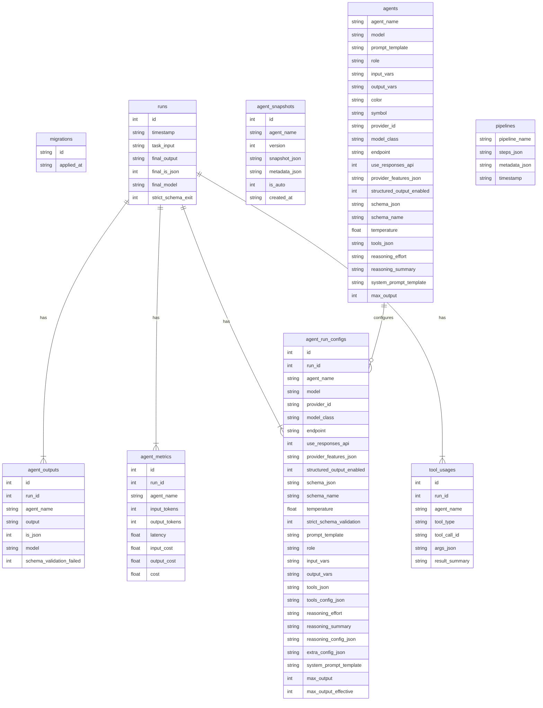

# 🧱 Migrations & DB (deep reference)

This document contains the detailed guidance for schema changes, migration generation, safe rebuilds, and includes a current schema ER diagram.

## Key paths
- Canonical schema: `src/multi_agent_dashboard/db/infra/schema.py`
- Migration generator: `src/multi_agent_dashboard/db/infra/generate_migration.py`
- Migrations directory: `data/migrations/`
- Safe rebuild tool: `src/multi_agent_dashboard/db/infra/sqlite_rebuild.py`
- DB default location: `data/db/multi_agent_runs.db`

## Workflow (recommended)

1. Update `schema.py` to reflect the intended schema change.

2. Install the package editable (recommended):
   ```bash
   pip install -e .
   ```

3. Preview diffs (dry-run):
   ```bash
   python -m multi_agent_dashboard.db.infra.generate_migration my_change --dry-run
   ```
   Review the output carefully.

4. Generate migration SQL:
   ```bash
   python -m multi_agent_dashboard.db.infra.generate_migration my_change
   ```
   This writes SQL files under `data/migrations/`.

5. Apply migrations:
   - Start the app (it calls `init_db`) or run a script that calls the init routine.
   - The migration system will apply new migrations in order.

6. Handling migrations that require rebuilds:
   - If the migration's MIGRATION-META header includes a `rebuild` object with a non-empty `requires_rebuild` list, and your DB is non-empty, run:
     ```bash
     # Preferred: run the sqlite_rebuild script directly so its internal
     # generate_migration subprocess can be located reliably.
     python src/multi_agent_dashboard/db/infra/sqlite_rebuild.py --all-with-diffs data/db/multi_agent_runs.db
     ```
     Use `--dry-run` first to preview. The rebuild tool creates backups before destructive ops.
   - The `_REQUIRES_REBUILD` suffix in filenames is a legacy artifact; detection uses the `rebuild` metadata in the MIGRATION-META header.

## Migration naming conventions

- Migration files are numbered sequentially (e.g., `016_add_strict_schema_validation_flags.sql`).
- **Do not rename or reorder migration files**; the system relies on sequential ordering.
- Destructive changes that require `sqlite_rebuild.py` are indicated by the `rebuild.requires_rebuild` metadata in the MIGRATION-META header, not by filename suffixes. (The `_REQUIRES_REBUILD` suffix in some filenames is a legacy artifact and not used for detection.)

## Important caveat about invocation

- `sqlite_rebuild.py` uses a subprocess to call the migration generator when `--all-with-diffs` is used. That subprocess invocation expects the `generate_migration.py` script to be runnable from the current working directory (it calls `"generate_migration.py"` as a relative executable). Because of this, two reliable options are:
  1. Run `sqlite_rebuild.py` as a direct script from the repository root/path where `generate_migration.py` is available (example shown above).
  2. First run the migration generator in dry-run to inspect diffs, then run `sqlite_rebuild.py` with explicit table names (single-table mode) — this avoids the internal generator subprocess.
- If you run `sqlite_rebuild` as a module (e.g., `python -m multi_agent_dashboard.db.infra.sqlite_rebuild ...`) the subprocess step may fail to locate `generate_migration.py`; prefer the direct-script invocation above for `--all-with-diffs`, or ensure `generate_migration.py` is callable from your current working directory.

## Notes on "fresh DB" heuristic

- The system treats a DB as "fresh" when no user-created tables exist or when existing user tables are empty; in that case, some rebuilds may be auto-applied. For non-empty DBs always prefer explicit `sqlite_rebuild.py` runs with backups.

## Safety checklist before applying destructive changes

1. Back up your DB (`cp data/db/multi_agent_runs.db data/db/multi_agent_runs.db.bak`).
2. Run `generate_migration --dry-run` and inspect SQL.
3. If rebuild required, run `sqlite_rebuild.py --dry-run` and review the plan.
4. Test migration application on a copy of your DB before applying to production/user data.

## Troubleshooting migrations

- If apply fails with FK/constraint errors, check generated SQL for order-of-operations and ensure FK rebuilds are handled via the rebuild tool.
- For large or complex schema changes, prefer staged migrations and careful review rather than a single big migration.

See also: [docs/ARCHITECTURE.md](ARCHITECTURE.md) (for storage layout) and [docs/CONFIG.md](CONFIG.md) (for DB path overrides).

## APPENDIX A: Database Schema Diagram

The current database schema (as defined in `src/multi_agent_dashboard/db/infra/schema.py`) consists of nine tables with the following relationships:



**Note:** The `migrations` table is used internally by the migration system and is not shown in relationships. The `agent_snapshots` table is decoupled from the `agents` table (no foreign key) to preserve history even if an agent is deleted.

For the exact column definitions and constraints, refer to the canonical schema in `schema.py`.